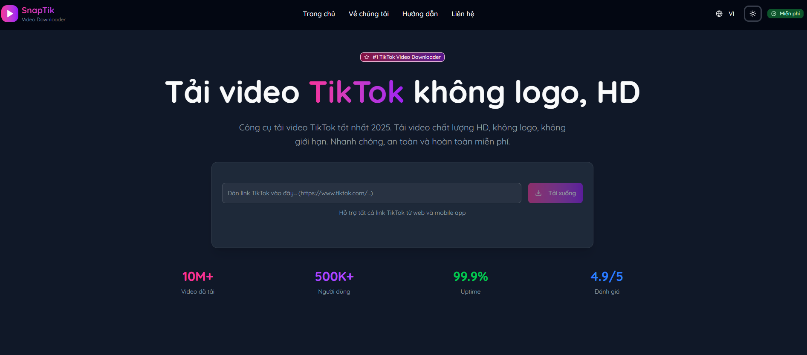

# SnapTikZ Pro - Tải video TikTok không logo miễn phí

---

## Giới thiệu

**SnapTikZ Pro** là một công cụ trực tuyến miễn phí giúp bạn tải video từ TikTok và Douyin mà **không dính logo (watermark)**. Công cụ này hoạt động trực tiếp trên trình duyệt, không yêu cầu cài đặt phần mềm và tương thích với mọi thiết bị (máy tính, điện thoại iPhone, Android).

Nói một cách đơn giản: Chỉ cần dán link video vào và tải về. Thật nhanh chóng và tiện lợi.

## Tính năng chính

- **Tải video không logo**: Loại bỏ hoàn toàn logo và ID người dùng.
- **Chất lượng cao**: Hỗ trợ tải video với chất lượng gốc, độ phân giải HD và Full HD+.
- **Tải nhạc nền (MP3)**: Dễ dàng tách và tải xuống âm thanh của bất kỳ video nào dưới dạng `.mp3`.
- **Hoàn toàn miễn phí**: Không thu phí, không giới hạn số lần tải.
- **Nhanh và đơn giản**: Giao diện trực quan, dễ sử dụng. Tốc độ xử lý và tải về nhanh.
- **Hỗ trợ đa nền tảng**: Hoạt động mượt mà trên mọi trình duyệt và thiết bị di động, PC.

## Hướng dẫn sử dụng

Chỉ cần làm theo 3 bước đơn giản dưới đây:

1.  **Lấy link video TikTok:**

    - Mở ứng dụng TikTok hoặc Douyin.
    - Tìm đến video bạn muốn tải.
    - Nhấn vào nút **Chia sẻ** (biểu tượng mũi tên) và chọn **Sao chép liên kết**.

2.  **Dán link và tải về:**

    - Truy cập vào trang web [**snaptikz.pro/vi**](https://snaptikz.pro/vi).
    - Dán liên kết vừa sao chép vào ô trống trên trang chủ.
    - Nhấn nút **Download**.

3.  **Lưu file:**
    - Chờ vài giây để hệ thống xử lý.
    - Chọn định dạng bạn muốn tải:
      - **Download (No Watermark):** Tải video không logo.
      - **Download MP3:** Tải file âm thanh.
    - Video hoặc file MP3 sẽ tự động được lưu về thiết bị của bạn.

---

## Tuyên bố miễn trừ trách nhiệm

- Công cụ này chỉ nên được sử dụng cho mục đích cá nhân.
- Việc tải xuống và sử dụng nội dung có bản quyền mà không có sự cho phép của chủ sở hữu là trách nhiệm của người dùng.
- **SnapTikZ Pro** không lưu trữ bất kỳ video nào trên máy chủ. Mọi video đều được tải trực tiếp từ máy chủ của TikTok/Douyin.
